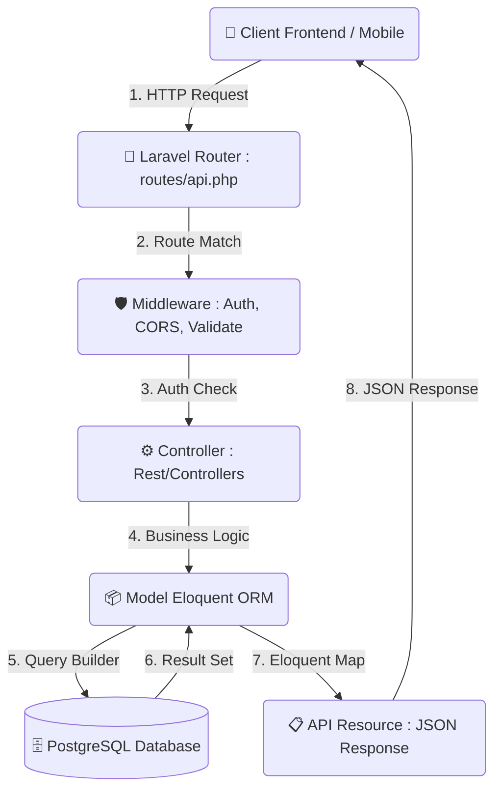

# 🏗️ Health-IA-Backend - API REST HealthAI Coach

**Backend API REST** de la plateforme HealthAI Coach, construite avec **Laravel 12** et **PostgreSQL**. Cette API gère les utilisateurs, les données nutritionnelles, les exercices et les métriques de santé.


---

## 📋 Table des matières

- [Vue d'ensemble](#vue-densemble)
- [Architecture](#architecture)
- [Stack technologique](#stack-technologique)
- [Installation](#installation)
- [Configuration](#configuration)
- [API Documentation](#api-documentation)
- [Base de données (PostgreSQL)](#base-de-données)
- [Admin Panel (Filament)](#admin-panel)
- [Développement](#développement)
- [Testing](#testing)
- [Troubleshooting](#troubleshooting)

---

## Vue d'ensemble

**Health-IA-Backend** est l'API REST centrale de la plateforme HealthAI Coach. Elle fournit tous les endpoints nécessaires pour :

- ✅ Gestion des utilisateurs et profils
- ✅ Gestion des aliments et recettes
- ✅ Gestion des exercices et activités
- ✅ Suivi des métriques de santé
- ✅ Authentification et autorisations
- ✅ Tableau de bord administrateur (Filament)

**Point d'entrée recommandé** : Le repository [Health-IA-Workspace](https://github.com/GroupMSPR/Health-IA-Workspace) qui orchestre l'ensemble du projet.

---

## Architecture

### Structure du projet (Détail complet)

```
Health-IA-Backend/
├── app/
│   ├── Access/                 # Contrôles d'accès et périmètres
│   │   ├── Controls/
│   │   └── Perimeters/
│   │
│   ├── Models/                 # Models & Pivots Eloquent 
│   │   ├── Constraint.php
│   │   ├── Consume.php
│   │   ├── Equipment.php
│   │   ├── Exercise.php
│   │   ├── Food.php
│   │   ├── Goal.php
│   │   ├── HealthMetric.php
│   │   ├── Muscle.php
│   │   ├── Practice.php
│   │   ├── PrimaryMuscle.php
│   │   ├── SecondaryMuscle.php
│   │   ├── Subscription.php
│   │   ├── User.php
│   │   └── [autres modèles]
│   │
│   ├── Policies/               # Policies d'autorisation
│   │
│   ├── Rest/                   # Lomkit REST API
│   │   ├── Controllers/
│   │   └── Resources/
│   │
│   ├── Filament/               # Admin Panel & Dashboard
│   │
│   ├── Http/                   # Controllers Custom, Middleware, Requests
│   │
│   └── Jobs/                   # Jobs en queue
│
├── database/                   # Migrations, seeders, factories
│
├── routes/                     # Fichiers de routes
│
├── config/                     # Fichiers de configuration
│
├── storage/                    # Fichiers générés, logs, cache
│
├── tests/                      # Tests unitaires et fonctionnels
│
├── bootstrap/                  # Fichiers de démarrage de l'application
│
├── public/                     # Point d'entrée web (index.php)
│
└── resources/                  # Vues, assets, filament
```

### Diagramme de flux - Requête API



---

## Stack technologique

### Backend
- **Framework** : Laravel 12
- **Langage** : PHP 8.3+
- **ORM** : Eloquent
- **API** : REST API avec Lomkit REST
- **Validation** : Form Requests
- **Auth** : JWT Sanctum

### Base de données
- **SGBD** : PostgreSQL 15
- **Migrations** : Laravel Migrations
- **Seeders** : Data Factories & Seeders

### Admin Panel
- **Framework** : Filament 3
- **Authentification** : Sanctum
- **Permissions** : Spatie/laravel-permission

### Testing
- **Framework** : PHPUnit
- **Factories** : Model Factories
- **Tests** : Unit & Feature tests

### DevOps
- **Containerization** : Docker
- **Orchestration** : Docker Compose
- **CI/CD** : GitHub Actions

### Documentation
- **API** : Swagger/OpenAPI
- **Endpoint docs** : `/api/documentation`

---

## Installation

### Prérequis

- Docker Desktop (recommandé pour l'environnement isolé)
- PHP 8.3+ (pour développement local)
- Composer
- PostgreSQL 15+ (si pas de Docker)

### Déploiement avec Docker (Recommandé)

```bash
# 1. Cloner depuis le workspace
git clone https://github.com/GroupMSPR/Health-IA-Workspace.git
cd Health-IA-Workspace

# 2. Lancer le script de déploiement
start.bat              # Windows
./start.sh             # Linux/Mac
```

### Installation locale

```bash
# 1. Cloner le repository
git clone https://github.com/GroupMSPR/Health-IA-Backend.git
cd Health-IA-Backend

# 2. Copier le fichier .env
cp .env.example .env

# 3. Installer les dépendances
composer install

# 4. Générer la clé APP
php artisan key:generate

# 5. Migrer et seeder la base de données
php artisan migrate --seed

# 6. Générer la documentation Swagger
php artisan l5-swagger:generate

# 7. Lancer le serveur
php artisan serve
```

---

## Configuration

### Variables d'environnement (.env)

```env
# Application
APP_NAME=HealthAI
APP_ENV=local
APP_DEBUG=true
APP_URL=http://localhost

# Base de données
DB_CONNECTION=pgsql
DB_HOST=pgsql
DB_PORT=5432
DB_DATABASE=laravel
DB_USERNAME=sail
DB_PASSWORD=password

# Port exposé sur Windows
FORWARD_DB_PORT=55432

# Authentification
SANCTUM_STATEFUL_DOMAINS=localhost

# Cache & Queue
CACHE_DRIVER=redis
QUEUE_CONNECTION=redis
```

### Configuration PostgreSQL

#### Depuis Windows (DBeaver/PhpStorm)

```
Host: localhost
Port: 55432
Database: laravel
Username: sail
Password: password
```

#### Depuis le conteneur

```
Host: pgsql (accessible uniquement entre conteneurs)
Port: 5432
Database: laravel
Username: sail
Password: password
```

---

## API Documentation

### Accès à la documentation

```
Swagger UI: http://localhost/api/documentation
```

### Endpoints principaux

#### 👥 Utilisateurs
| Méthode | Endpoint | Description |
|---------|----------|-------------|
| POST | `/api/auth/register` | Créer un compte |
| POST | `/api/auth/login` | Se connecter |
| POST | `/api/auth/logout` | Se déconnecter |
| GET | `/api/users/profile` | Récupérer profil |
| PUT | `/api/users/profile` | Mettre à jour profil |

#### 🍎 Aliments
| Méthode | Endpoint | Description |
|---------|----------|-------------|
| GET | `/api/foods` | Lister les aliments |
| POST | `/api/foods` | Créer un aliment |
| GET | `/api/foods/{id}` | Détail d'un aliment |
| PUT | `/api/foods/{id}` | Mettre à jour |
| DELETE | `/api/foods/{id}` | Supprimer |

#### 💪 Exercices
| Méthode | Endpoint | Description |
|---------|----------|-------------|
| GET | `/api/exercises` | Lister les exercices |
| POST | `/api/exercises` | Créer un exercice |
| GET | `/api/exercises/{id}` | Détail d'un exercice |
| PUT | `/api/exercises/{id}` | Mettre à jour |
| DELETE | `/api/exercises/{id}` | Supprimer |

#### 📊 Métriques de santé
| Méthode | Endpoint | Description |
|---------|----------|-------------|
| GET | `/api/metrics` | Lister les métriques |
| POST | `/api/metrics` | Enregistrer une métrique |
| GET | `/api/metrics/user/{id}` | Métriques d'un utilisateur |

#### 🔧 Contraintes (Récent)
| Méthode | Endpoint | Description |
|---------|----------|-------------|
| GET | `/api/constraints` | Lister les contraintes |
| POST | `/api/constraints` | Créer une contrainte |
| GET | `/api/constraints/{id}` | Détail d'une contrainte |
| PUT | `/api/constraints/{id}` | Mettre à jour |
| DELETE | `/api/constraints/{id}` | Supprimer |

#### 🏋️ Équipements (Récent)
| Méthode | Endpoint | Description |
|---------|----------|-------------|
| GET | `/api/equipment` | Lister les équipements |
| POST | `/api/equipment` | Créer un équipement |
| GET | `/api/equipment/{id}` | Détail d'un équipement |
| PUT | `/api/equipment/{id}` | Mettre à jour |
| DELETE | `/api/equipment/{id}` | Supprimer |

#### 🎯 Objectifs (Récent)
| Méthode | Endpoint | Description |
|---------|----------|-------------|
| GET | `/api/goals` | Lister les objectifs |
| POST | `/api/goals` | Créer un objectif |
| GET | `/api/goals/{id}` | Détail d'un objectif |
| PUT | `/api/goals/{id}` | Mettre à jour |
| DELETE | `/api/goals/{id}` | Supprimer |

#### 💪 Muscles (Récent)
| Méthode | Endpoint | Description |
|---------|----------|-------------|
| GET | `/api/muscles` | Lister les groupes musculaires |
| POST | `/api/muscles` | Créer un groupe musculaire |
| GET | `/api/muscles/{id}` | Détail d'un groupe |
| PUT | `/api/muscles/{id}` | Mettre à jour |
| DELETE | `/api/muscles/{id}` | Supprimer |

#### 🔐 Abonnements (Récent)
| Méthode | Endpoint | Description |
|---------|----------|-------------|
| GET | `/api/subscriptions` | Lister les abonnements |
| POST | `/api/subscriptions` | Créer un abonnement |
| GET | `/api/subscriptions/{id}` | Détail d'un abonnement |
| PUT | `/api/subscriptions/{id}` | Mettre à jour |
| DELETE | `/api/subscriptions/{id}` | Supprimer |

### Authentification

Tous les endpoints sauf `/auth/register` et `/auth/login` requièrent un token Bearer :

```bash
curl -H "Authorization: Bearer YOUR_TOKEN" \
     http://localhost/api/user
```

### Réponses API

#### Succès (200 OK)
```json
{
  "status": "success",
  "data": {
    "id": 1,
    "name": "John Doe",
    "email": "john@example.com"
  }
}
```

#### Erreur (4xx/5xx)
```json
{
  "status": "error",
  "message": "Ressource non trouvée",
  "errors": {
    "email": ["Email invalide"]
  }
}
```

---

## Base de données

### Modèles

#### User
```
- id: ID primaire
- name: Nom complet
- email: Email unique
- password: Mot de passe hashé
- avatar: URL de l'avatar
- bio: Biographie
- created_at: Date de création
- updated_at: Dernière modification
```

#### Food
```
- id: ID primaire
- name: Nom du food
- calories: Calories par portion
- protein: Protéines (g)
- fat: Lipides (g)
- carbs: Glucides (g)
- description: Description
- image: URL image
- created_at: Date de création
```

#### Exercise
```
- id: ID primaire
- name: Nom de l'exercice
- duration: Durée (minutes)
- calories_burned: Calories brûlées
- difficulty: Niveau de difficulté
- description: Description
- image: URL image
- created_at: Date de création
```

#### HealthMetric
```
- id: ID primaire
- user_id: Référence utilisateur
- weight: Poids (kg)
- height: Taille (cm)
- bmi: Indice de masse corporelle
- heart_rate: Fréquence cardiaque
- blood_pressure: Tension artérielle
- date: Date de la mesure
- created_at: Date de création
```

#### Constraint (Nouveau)
```
- id: ID primaire
- name: Nom de la contrainte
- description: Description
- type: Type (physique, diète, etc.)
- severity: Sévérité (low, medium, high)
- created_at: Date de création
```

#### Equipment (Nouveau)
```
- id: ID primaire
- name: Nom de l'équipement
- description: Description
- category: Catégorie
- image: URL image
- created_at: Date de création
```

#### Goal (Nouveau)
```
- id: ID primaire
- name: Nom de l'objectif
- description: Description
- category: Catégorie (fitness, santé, etc.)
- duration: Durée estimée (jours)
- target_value: Valeur cible
- created_at: Date de création
```

#### Muscle (Nouveau)
```
- id: ID primaire
- name: Nom du groupe musculaire
- description: Description
- image: URL image
- latin_name: Nom scientifique
- created_at: Date de création
```

#### Subscription (Nouveau)
```
- id: ID primaire
- user_id: Référence utilisateur
- plan: Type d'abonnement (free, premium, pro)
- status: Statut (active, inactive, cancelled)
- start_date: Date de début
- end_date: Date de fin
- created_at: Date de création
```

### Migrations

Lancer les migrations :

```bash
# Exécuter toutes les migrations
php artisan migrate

# Avec seeders
php artisan migrate --seed

# Reset complet (dangereux !)
php artisan migrate:fresh --seed
```

Vérifier l'état des migrations :

```bash
php artisan migrate:status
```

### Seeders

Les seeders remplissent la base de données avec des données de test :

```bash
# Exécuter tous les seeders
php artisan db:seed

# Exécuter un seeder spécifique
php artisan db:seed --class=UserSeeder
```

---

## Admin Panel

### Accès

```
URL: http://localhost/admin
Email: admin@example.com
Password: password
```

### Fonctionnalités

L'Admin Panel (Filament) permet de :

- ✅ Gérer les utilisateurs
- ✅ Gérer les aliments
- ✅ Gérer les exercices
- ✅ Consulter les métriques de santé
- ✅ Voir les statistiques globales
- ✅ Configurer les paramètres

### Ressources disponibles

- **Users** - Gestion des utilisateurs
- **Foods** - Catalogue des aliments
- **Exercises** - Catalogue des exercices
- **Health Metrics** - Suivi des métriques
- **Dashboard** - Tableau de bord statistiques

---

## Développement

### Structure de code

#### Contrôleurs (Controllers)

```
app/Http/Controllers/
├── Api/
│   ├── UserController.php
│   ├── FoodController.php
│   ├── ExerciseController.php
│   └── HealthMetricController.php
└── Admin/
    └── (Gérés par Filament)
```

#### Modèles (Models)

```
app/Models/
├── User.php
├── Food.php
├── Exercise.php
└── HealthMetric.php
```

#### Validations (Requests)

```
app/Http/Requests/
├── StoreUserRequest.php
├── UpdateUserRequest.php
├── StoreFoodRequest.php
└── ...
```

### Ajouter une nouvelle ressource API

#### 1. Créer le modèle

```bash
php artisan make:model Recipe -m
```

#### 2. Créer le contrôleur

```bash
php artisan make:controller Api/RecipeController --model=Recipe --resource
```

#### 3. Ajouter les routes

```php
// routes/api.php
Route::apiResource('recipes', RecipeController::class);
```

#### 4. Implémenter les endpoints

#### 5. Ajouter les tests

---

## Testing

### Exécuter les tests

```bash
# Tous les tests
php artisan test

# Seulement les tests unitaires
php artisan test --unit

# Seulement les tests feature
php artisan test --feature

# Avec coverage
php artisan test --coverage
```

### Créer un test

```bash
php artisan make:test UserTest
php artisan make:test Api/UserApiTest --unit
```

### Exemple de test

```php
<?php

namespace Tests\Feature\Api;

use Tests\TestCase;
use App\Models\User;

class UserApiTest extends TestCase
{
    public function test_can_get_user_profile()
    {
        $user = User::factory()->create();
        
        $response = $this->actingAs($user)
            ->getJson('/api/users/profile');
        
        $response->assertStatus(200)
            ->assertJsonStructure(['data' => ['id', 'name', 'email']]);
    }
}
```

---

## Troubleshooting

### Erreur de connexion PostgreSQL

**Problème** : `SQLSTATE[08006] could not connect to server`

**Solutions** :
```bash
# Vérifier que Docker est lancé
docker ps

# Vérifier que le conteneur PostgreSQL fonctionne
docker compose ps

# Redémarrer les conteneurs
docker compose restart pgsql
```

### Migrations échouées

**Problème** : `Migration table not found`

**Solutions** :
```bash
# Vérifier l'état des migrations
php artisan migrate:status

# Rafraîchir la base
php artisan migrate:fresh --seed
```

### Erreur d'authentification API

**Problème** : `Unauthorized` sur les endpoints protégés

**Solutions** :
- Vérifier que le token est envoyé dans le header `Authorization: Bearer <token>`
- Vérifier que le token n'est pas expiré
- Générer un nouveau token via `/api/auth/login`

### Problèmes de CORS

**Problème** : `Access to XMLHttpRequest has been blocked by CORS policy`

**Solutions** :
```php
// config/cors.php
'allowed_origins' => ['http://localhost:3000', 'http://localhost:5173'],
```

### Permission refusée sur les fichiers

**Problème** : `storage/ directory is not writable`

**Solutions** :
```bash
# Docker
docker compose exec laravel.test chmod -R 777 storage bootstrap/cache

# Local
chmod -R 777 storage bootstrap/cache
```

---

## Performance et optimisation

### Caching

```php
// Cache une requête
Cache::remember('users', 60, function () {
    return User::all();
});
```

### Eager loading

```php
// Éviter N+1 queries
$users = User::with('metrics')->get();
```

### Database indexing

```php
// Dans les migrations
$table->index('email');
$table->unique('email');
```

---

## Déploiement

### Déploiement sur serveur

```bash
# 1. Cloner le repository
git clone https://github.com/GroupMSPR/Health-IA-Backend.git

# 2. Installer les dépendances
composer install --no-dev

# 3. Configurer l'environnement
cp .env.example .env
# Éditer .env avec les bonnes valeurs

# 4. Générer la clé
php artisan key:generate

# 5. Lancer les migrations
php artisan migrate --force

# 6. Optimiser
php artisan config:cache
php artisan route:cache
php artisan view:cache
```

### Variables d'environnement production

```env
APP_ENV=production
APP_DEBUG=false
DB_HOST=your-db-host
DB_PASSWORD=secure-password
MAIL_FROM_ADDRESS=noreply@healthai.com
```

---

## 📚 Documentation supplémentaire

- [Laravel Documentation](https://laravel.com/docs)
- [Filament Documentation](https://filamentadmin.com)
- [PostgreSQL Documentation](https://www.postgresql.org/docs/)
- [API Documentation](http://localhost/api/documentation)

---

## 👥 Équipe

**Développeurs MSPR** : Ilan, Anthony, Diana

---

## 📄 Licence

Ce projet est sous licence MIT. Voir le fichier [LICENSE](LICENSE) pour plus de détails.

---

## 🔗 Liens

- **Organization** : [GroupMSPR](https://github.com/GroupMSPR)
- **Workspace** : [Health-IA-Workspace](https://github.com/GroupMSPR/Health-IA-Workspace)
- **Frontend** : [Health-IA-Frontend](https://github.com/GroupMSPR/Health-IA-Frontend)
- **ETL** : [Health-IA-ETL](https://github.com/GroupMSPR/Health-IA-ETL)
- **FastAPI** : [Health-IA-FastAPI](https://github.com/GroupMSPR/Health-IA-FastAPI)
- **Grafana** : [Health-IA-Grafana](https://github.com/GroupMSPR/Health-IA-Grafana)

---

**Dernière mise à jour** : 29 mai 2026

Pour toute question ou contribution, consultez le repository ou ouvrez une issue.
